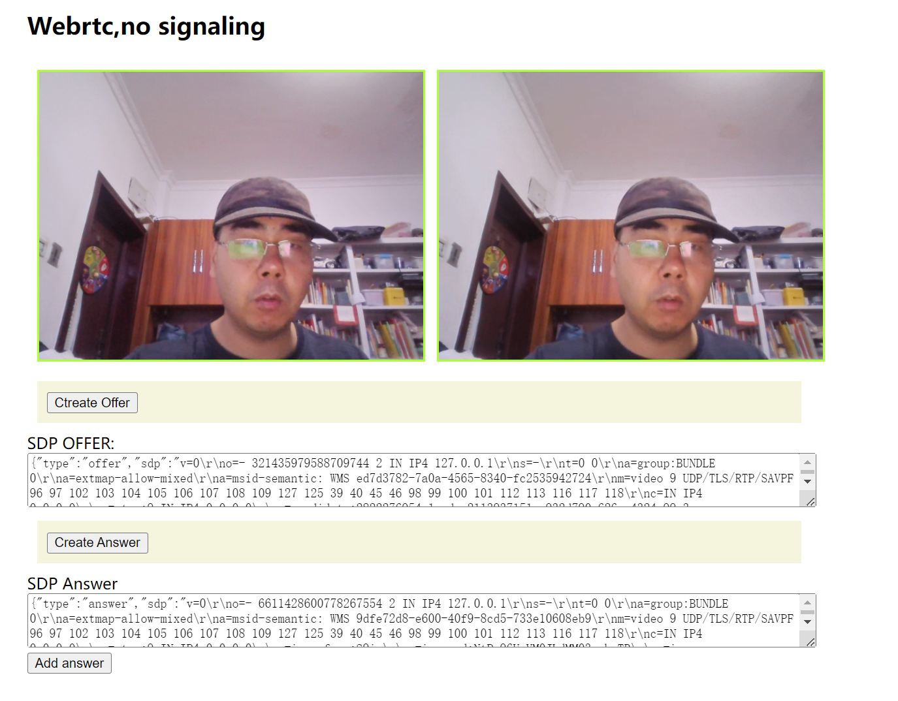

# 项目介绍:
该项目是一个使用js实现的webrtc视频通话

# main

ice地址测试页面:

https://webrtc.github.io/samples/src/content/peerconnection/trickle-ice/

google 免费stun地址:

stun:stun.l.google.com:19302

# v0.2

增加了信令服务websocket-server来转发sdp信息
   
websocket-server 仓库地址:

git@github.com:SnailCoderGu/websocket-server.git

# v0.1
使用拷贝sdp的方式，web页面视频通话
